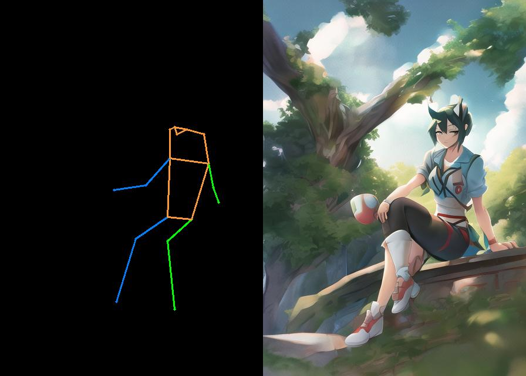
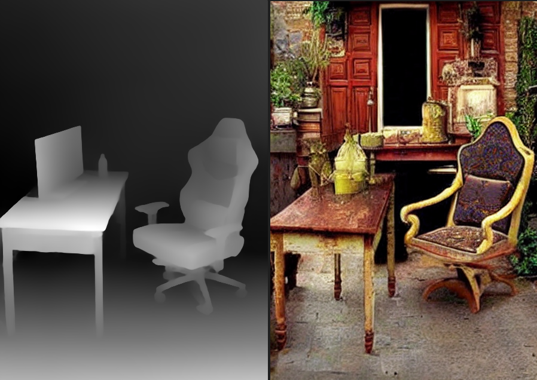

# T2I Adapter Diffusers

Developer-friendly port of the [T2I-Adapter](https://github.com/TencentARC/T2I-Adapter), [Paper](https://arxiv.org/abs/2302.08453) to `diffusers`. As a result, you are able to use all the pipelines at diffusers. You can also use my [LoRA](https://github.com/cloneofsimo/lora).

<!-- #region -->
<p align="center">

</p>
<!-- #endregion -->

<!-- #region -->
<p align="center">

</p>
<!-- #endregion -->

## Installation

```bash
pip install git+https://github.com/cloneofsimo/t2i-adapter-diffusers
```

## Usage

Example code Using all of the adapters is at `test_all.py`. In short, you need to substitute `UNet2DConditionModel` to `T2IAdapterUNet2DConditionModel`. This can be done with patch_pipe.

Example with keypose adapter:

```python
from t2i_adapters import patch_pipe, Adapter

# 1. Define model and patch to t2i-adapter

model_id = "runwayml/stable-diffusion-v1-5"

pipe = StableDiffusionPipeline.from_pretrained(model_id, torch_dtype=torch.float16).to(
    device
)
patch_pipe(pipe)

# 2 Extract features with adapter
adapter = Adapter.from_pretrained("keypose").to(device)

# 2.1 prepare condition image
cond_img = Image.open(f"./contents/examples/{ext_type}_0.png").convert("RGB")
cond_img = np.array(cond_img)/255.0
cond_img = torch.from_numpy(cond_img).permute(2, 0, 1).unsqueeze(0).to(device).float()

# 2.2 prepare feature
with torch.no_grad():
    adapter_features = adapter(cond_img)

# 3. set condition statefully. You can also call unet and make your own sampler. In that case, adapter feature attribute will be ignored.

pipe.unet.set_adapter_features(adapter_features)

# sample...
pipe(...)
```

## References

```bibtex
@misc{https://doi.org/10.48550/arxiv.2302.08453,
  doi = {10.48550/ARXIV.2302.08453},
  url = {https://arxiv.org/abs/2302.08453},
  author = {Mou, Chong and Wang, Xintao and Xie, Liangbin and Zhang, Jian and Qi, Zhongang and Shan, Ying and Qie, Xiaohu},
  keywords = {Computer Vision and Pattern Recognition (cs.CV), Artificial Intelligence (cs.AI), Machine Learning (cs.LG), Multimedia (cs.MM), FOS: Computer and information sciences, FOS: Computer and information sciences},
  title = {T2I-Adapter: Learning Adapters to Dig out More Controllable Ability for Text-to-Image Diffusion Models},
  publisher = {arXiv},
  year = {2023},
  copyright = {Creative Commons Attribution 4.0 International}
}
```
